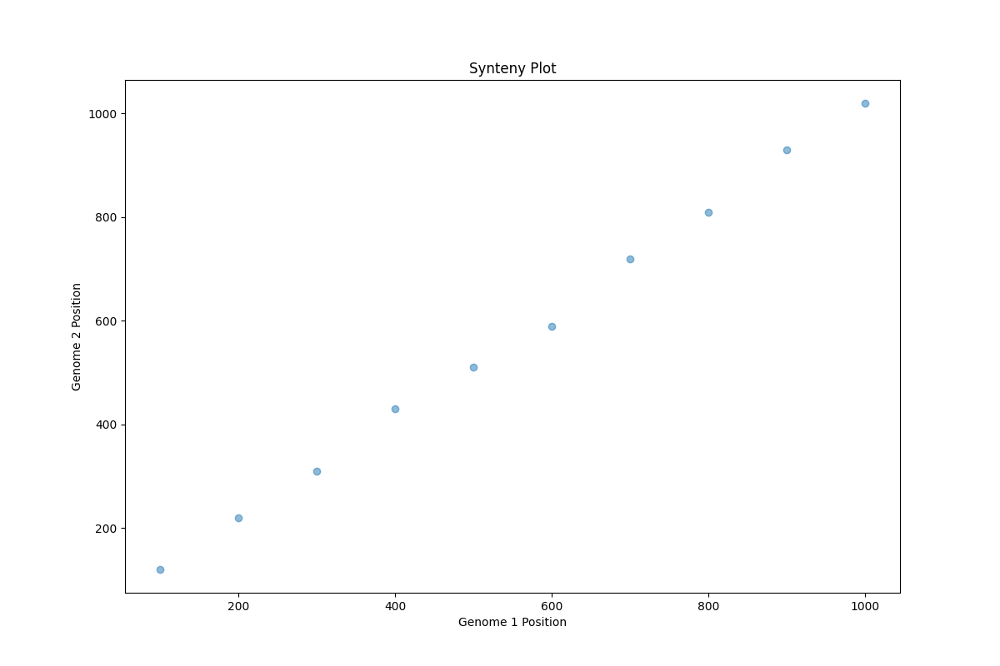

# WGDI Inspired Tool
## A Simple Synteny Visualization Tool

---

# What is Synteny?

- Synteny refers to the conservation of gene order across different species
- Important for understanding genome evolution and identifying homologous regions

---

# Our Tool

- Inspired by WGDI (Whole Genome Duplication Identification)
- Provides a simple way to visualize synteny between two genomes
- Easy to use for researchers with basic command-line knowledge

---

# Features

- Reads synteny data from CSV files
- Generates scatter plots to visualize syntenic regions
- Customizable output

---

# How to Use

1. Prepare your synteny data in CSV format
2. Run the tool with input and output file paths
3. Analyze the generated synteny plot

---

# Example Output

---

# Future Improvements

- Implement more advanced synteny analysis algorithms
- Add support for multiple genomes comparison
- Integrate with existing bioinformatics pipelines

---

# Thank You!

Developed by Mariana Silva de Oliveira
GitHub: https://github.com/ezrafchev/wgdi-inspired

